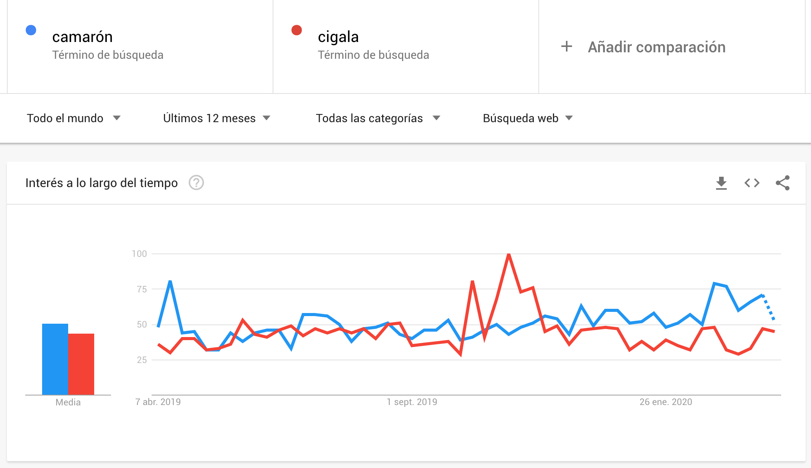
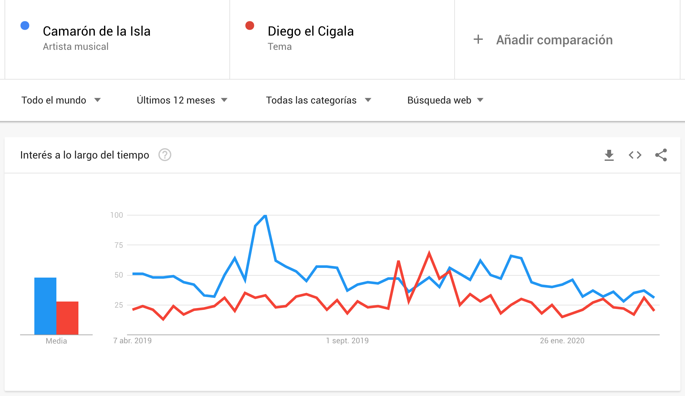
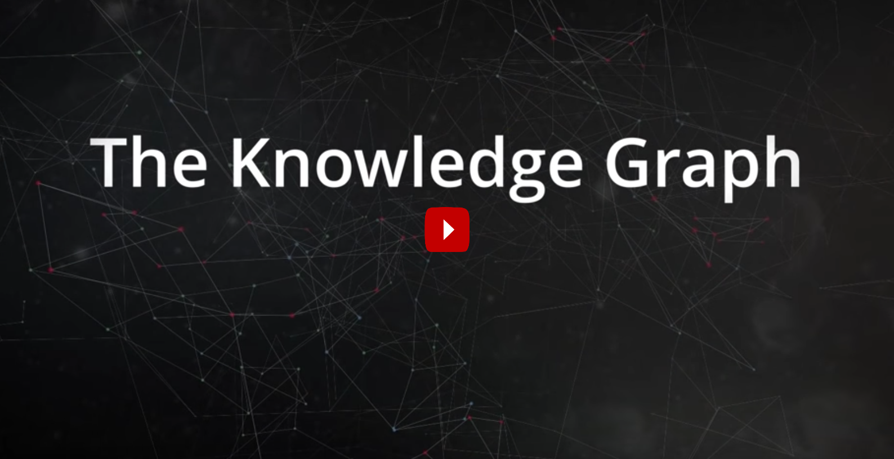

# Búsquedas con semántica

!!! note "Actividad: Google Trends"
    [Google Trends](https://trends.google.es/trends/) es un servicio que permite averiguar qué está buscando la gente.

    - [ ] Completar la actividad [Google Trends: mejora los resultados de tu búsqueda](https://newsinitiative.withgoogle.com/training/lesson/6043276230524928)

En la actividad anterior, Google Trends contabiliza y clasifica las búsquedas por **palabras clave** realizadas por los usuarios. ¿Qué sucede cuando hay varias palabras clave, combinaciones de palabras o sinónimos, que corresponden a un mismo **concepto**? Por ejemplo, la _energía de las olas_ también puede llamarse _undimotriz_. Los usuarios que están interesados en dicho concepto podrían haber buscado indistintamente usando un término u otro. Si nos fijamos exclusivamente en palabras clave, Google Trends no tendría manera de asociar ambas combinaciones de palabras clave y considerar que corresponden a un mismo concepto del que queremos medir su tendencia en las búsquedas realizadas.

Pero también pueden producirse ambigüedades en los términos de búsqueda por palabras clave. Por ejemplo, los términos de búsqueda "camarón" o "cigala" pueden referirse a crustáceos o a artistas flamencos.

!!! note "Búsquedas por términos o palabras clave"
    - [ ] Comparar las tendencias de búsqueda durante el último año de los términos de búsqueda _camarón_ frente a _cigala_ hasta obtener el siguiente [resultado](https://trends.google.es/trends/explore?q=camar%C3%B3n,cigala).

    

    Como puede observarse, la diferencia entre ambos términos es escasa; incluso parece que en determinados periodos, la búsqueda de _cigala_ ha sido más _trendy_ que la de _camarón_.

!!! note "Búsquedas por conceptos"
    - [ ] Comparar ahora las tendencias de búsqueda durante el último año de los conceptos _Camarón de la Isla_ frente a _Diego el Cigala_ hasta obtener el siguiente [resultado](https://trends.google.es/trends/explore?q=%2Fm%2F01x2xgy,%2Fm%2F07f24z).

    

    En esta ocasión, la diferencia entre ambas búsquedas es más amplia a lo largo del tiempo, a favor del primer concepto.

!!! tip "Significado de los términos"
    ¿Cuál era la intención de cada usuario que hizo una búsqueda cuando escribió _camarón_? ¿Y cuándo buscaba _cigala_? ¿Quería preparar una receta de cocina o asistir a un espectáculo musical?
    
    Dicho de otra forma ¿cuál era el **significado** o la **semántica** que cada usuario le da a sus términos de búsqueda?

    Las búsquedas realizadas y los resultados del análisis de tendencias no deben ser los mismos, dependiendo de si dicho análisis nos lo contrata una empresa comercializadora de marisco o si lo contrata una cátedra de flamencología.

Un mismo contenido de la Web puede tener diversos significados (polisemia). También puede haber múltiples maneras de nombrar a un mismo concepto (sinonimia). Incluso puede haber conceptos que sean subconceptos de otros, y a los que por comodidad nos queramos referir por su concepto más general (hiperonimia) o específico (hiponimia): por ejemplo, es más cómodo buscar por _marisco_ que por la lista de todos los posibles crustáceos que le vienen bien a un arroz.

Hay muchas más relaciones semánticas que podrían interesarnos. Por ejemplo, querríamos poder expresar la relación _marido de_ para analizar cuántos de los maridos de _tonadilleras_ son o han sido _toreros_. Dicha relación _marido de_ sirve para enlazar los hiperónimos de _torero_ y _tonadillera_ (o de _torera_ y _tonadillero_, indistintamente).

Pero un ordenador es incapaz de distinguir estas y otras relaciones semánticas, a menos que se las expliquemos detalladamente. Esta es la tarea a resolver para la **web semántica** y está basada en los siguientes conceptos:

- Metadatos
- Vocabularios
- Formatos estructurados

Gracias a estos elementos, las búsquedas y otras operaciones en la Web pueden verse mejoradas con características semánticas, construyendo lo que Google bautizó como _Knowledge Graph_.

!!! note "Knowledge Graph"
    - [ ] Ver el vídeo siguiente sobre el _grafo de conocimiento_ de Google:

## Metadatos

Cualquier dato se puede _anotar_ o _etiquetar_ con otros datos que expliquen algún aspecto sobre el dato original, es decir, con [metadatos](https://es.wikipedia.org/wiki/Metadatos).

Google ha puesto en práctica un tipo especial de metadatos, a los que llama [datos estructurados](https://developers.google.com/search/docs/guides/intro-structured-data). Los datos estructurados son pequeños fragmentos de código que se pueden añadir a las páginas de tu sitio web para describir su contenido y ayudar a que los buscadores comprendan mejor lo que contienen.

Gracias a estos metadatos, los buscadores pueden mostrar el contenido de forma más útil y llamativa en los resultados de búsqueda, lo que a su vez puede ayudar a atraer al tipo de clientes adecuado. El buscador podrá mostrar entonces _resultados enriquecidos_ como resultado de las búsquedas.

!!! note "Datos estructurados de Google"
    - [ ] Leer la sección _Añade marcado de datos estructurados_ de la [Guía de SEO para principiantes](https://developers.google.com/search/docs/beginner/seo-starter-guide?hl=es&visit_id=637533179330630787-545203344&rd=1#add-structured-data-markup).

<!--
Esquemas
BD relacionales: registros, índices, facetas
-->

## Vocabularios

Para anotar que un determinado _contenido web_ tiene asociado un cierto _significado_, hace falta definir primero un conjunto de significados válidos, comprensibles por el buscador. Estos significados asociables a un cierto _significante_ (esto es, el contenido) forman parte de **vocabularios** y tesauros. Hay muchos vocabularios posibles, destacando los siguientes:

- Los vocabularios [Linked Open Vocabulary](https://lov.linkeddata.es/dataset/lov/) (LOV): tipos y propiedades para definir personas, lugares, productos, eventos y muchos otros tipos de cosas. Suelen estar definidos en un formato conocido como [RDF](https://es.wikipedia.org/wiki/Resource_Description_Framework).

- Los vocabularios de [schema.org](http://schema.org/): iniciativa fundada por Google, Microsoft, Yahoo y Yandex para que webmasters y desarrolladores web se pongan de acuerdo en un conjunto de vocabularios común. Los tipos de contenido que el buscador de Google indexa y comprende actualmente son los de la [galería de búsqueda](https://developers.google.com/search/docs/guides/search-gallery). Están definidos en formatos como [JSON-LD](https://en.wikipedia.org/wiki/JSON-LD) y [RDFa](https://en.wikipedia.org/wiki/RDFa) y [microdata HTML](https://en.wikipedia.org/wiki/Microdata_(HTML)).

## Formatos de datos estructurados

Los formatos de datos estructurados más comunes son:

- **Microdatos**: Una extensión de HTML con la que se pueden incrustar datos estructurados dentro de contenido normal HTML. Las propiedades que se quieren exponer como datos estructurados deben marcarse con atributos de etiquetas HTML.
- **RDFa**: Una extensión HTML5 que admite datos vinculados mediante atributos de etiquetas HTML que corresponden al contenido que los usuarios pueden ver y que se quiere describir para los motores de búsqueda.
- **JSON-LD**: Una notación basada en [JSON](https://es.wikipedia.org/wiki/JSON) insertada en una etiqueta `<script>` situada en el encabezado o el cuerpo de la página. Sirve para  expresar elementos de datos como el país ([`Country`](https://schema.org/Country)), de una dirección postal ([`PostalAddress`](https://schema.org/PostalAddress)) o el lugar ([`MusicVenue`](https://schema.org/MusicVenue)) de un evento ([`Event`](https://schema.org/Event)). 

!!! note "Jerarquía de esquemas de schema.org"
    - [ ] Explorar toda la [jerarquía](https://schema.org/docs/full.html) de tipos del vocabulario de schema.org.
    - [ ] Buscar y contabilizar cuántos tipos de schema.org parecen útiles para enriquecer contenidos web en los siguientes sectores económicos: artes audiovisuales, salud y bienestar, viajes, educación y cultura, finanzas, administración pública.
    - [ ] ¿Cuál de los sectores anteriores parece mejor representado en los vocabularios de schema.org?

Otros formatos de datos estructurados, en los que se basan algunos de los anteriores, son [XML](https://es.wikipedia.org/wiki/Extensible_Markup_Language) (_eXtensible Markup Language_), [RDF](https://es.wikipedia.org/wiki/Resource_Description_Framework) (_Resource Description Framework_) y [JSON](https://es.wikipedia.org/wiki/JSON) (_JavaScript Object Notation_).

!!! note "Lecturas para profundizar: Datos Estructurados de Google"
    - [ ] [Cómo funcionan los datos estructurados](https://developers.google.com/search/docs/guides/intro-structured-data): cuál es el contenido de los fragmentos de código de los contenidos Web _enriquecidos_ y qué formatos comprende Google para estos metadatos (por ejemplo, JSON-LD, RDFa, microdata).
    - [ ] [Consultar la galería de búsqueda](https://developers.google.com/search/docs/guides/search-gallery): cuáles son los tipos de contenido que Google comprende y con los que se pueden enriquecer las páginas web.
    - [ ] [Asistente de marcado](https://www.google.com/webmasters/markup-helper/u/0/): para enriquecer un contenido web con datos estructurados.
    - [ ] [_Does your page support rich results?_](https://search.google.com/test/rich-results): Herramienta de prueba de los datos estructurados para enriquecer una búsqueda.
    - [ ] [Informes de estado de resultados enriquecidos](https://support.google.com/webmasters/answer/7552505): Informe para averiguar si una página tiene sus datos estructurados bien descritos.

# Datos enlazados y web semántica

Gracias a las tecnologías anteriores de metadatos y datos estructurados, se puede construir una versión evolucaionada de la World Wide Web, enriquecida con significado y que hiperenlace conceptos, en lugar de páginas. Es lo que Google ha venido a llamar _Knowledge Graph_, pero que tiene sus ancestros en la [_Linked Open Data_](https://es.wikipedia.org/wiki/Datos_enlazados) (LOD) y la [_Semantic Web_](https://es.wikipedia.org/wiki/Web_sem%C3%A1ntica) de Tim Berners Lee.

El objetivo de los [datos enlazados](https://es.wikipedia.org/wiki/Datos_enlazados) es que puedan ser consumidos por agentes automatizados (programas de ordenador). La LOD no está enfocada en páginas consumibles por los usuarios humanos. En su lugar, LOD tiene como objetivo que exista un gran volumen de información en la Web, preparada para ser procesada automáticamente (_machine-readable_) por programas de ordenador.

Para que esta información hiperenlazada sea consumible por un programa informático, debe construirse con metadatos, vocabularios y formatos de datos estructurados como los anteriores. Además, cada concepto debe poder ser vinculado o enlazado con otros conceptos relacionados, a través de propiedades y relaciones bien definidas. Algunos ejemplos de grandes conjuntos de datos enlazados son:

- [DBPedia](https://wiki.dbpedia.org/about): Versión LOD de wikipedia, construida y alimentada a partir del contenido estructurado que aparece en la parte derecha de cada página en wikipedia.
- [Wikidata](https://www.wikidata.org/wiki/Wikidata:Main_Page): Base de conocimiento abierta, formada por datos estructurados y construida como una wiki que es editada por humanos y por programas automatizados (_máquinas_). Es parte de la familia de productos wikimedia.

!!! note "Lecturas recomendadas: LOD, Web semántica y Knowledge Graph"
    - [ ] Leer la introducción a [Knowledge Graph](https://www.google.com/search/howsearchworks/responses/) de Google

<!--
# Codificación

## Caracteres

ASCII, UTF-8, Fechas

## Formatos no estructurados

PNG, SVG, etc

-->

<!--
# Limpieza de datos

Open Refine
-->