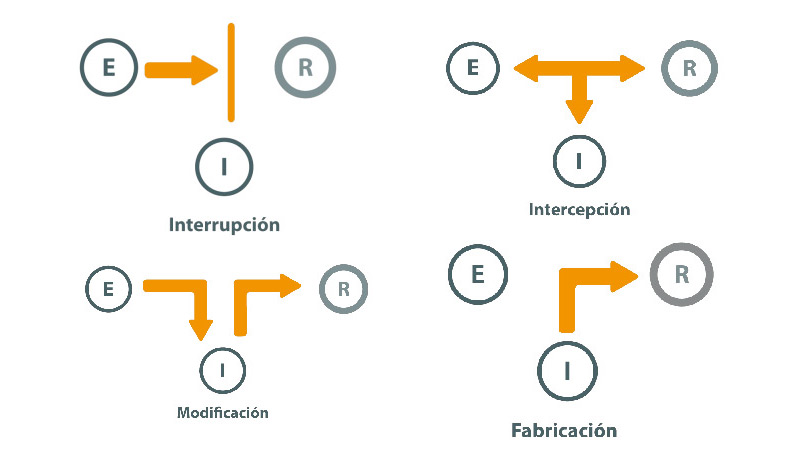
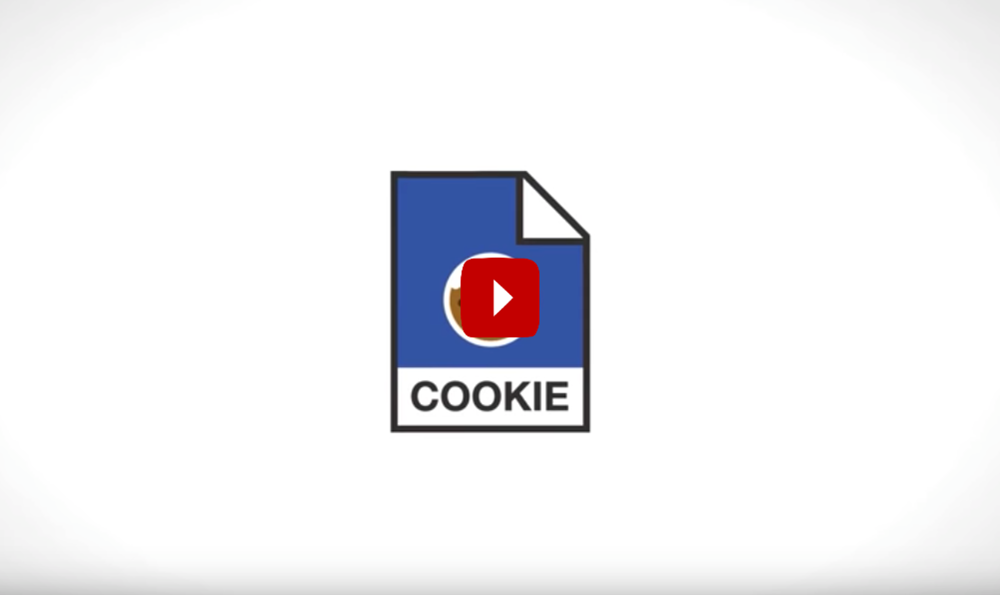

# Seguridad

Cualquier _sistema_ o _recurso_ informático, ya sea un servidor, un sitio, un dato, una aplicación o una página web, debe protegerse contra accesos indebidos. Los siguientes son los **requisitos de seguridad** deseables de cualquier sistema informático:

- **Confidencialidad**: Asegurar que sólo los usuarios autorizados pueden leer (tener _acceso para lectura_) los recursos del sistema.
- **Integridad**: Asegurar que sólo los usuarios autorizados pueden modificar (tener _acceso para escritura_) los recursos del sistema.
- **Disponibilidad**: Asegurar que aquellos (y solo aquellos) usuarios que estén autorizados para el acceso (ya sea para lectura o para escritura) a los recursos de un sistema pueden hacerlo efectivamente.

## Amenazas

Las amenazas más comunes a los requisitos CID (Confidencialidad, Integridad, Disponibilidad) o CIA en inglés (_Confidentiality_, _Integrity_, _Availability_) se pueden clasificar en función de los factores que se ve comprometido:

- **Intercepción**
- **Modificación**
- **Interrupción**
- **Fabricación**

!!! note "Clases de amenazas a la seguridad"
    Leer el apartado _Naturaleza de las amenazas_ del monográfico [Introducción a la seguridad informática - Amenazas](http://recursostic.educacion.es/observatorio/web/es/software/software-general/1040-introduccion-a-la-seguridad-informatica?start=5).

## Seguridad en un sistema abierto

La World Wide Web es un **[sistema abierto](https://es.wikipedia.org/wiki/Sistema_abierto)** al que cualquier persona o agente puede acceder. Como tal, hay que **proteger** todos los sistemas y recursos informáticos que existen en la Web. Los datos, las páginas y las aplicaciones web son recursos a los que puede acceder cualquiera, no siempre con buenos propósitos.

Las siguientes son algunas de las características más habituales de la seguridad en un sistema abierto:

- **Autenticación**: Identificación de las entidades participantes en una comunicación y del origen de los datos intervinientes en la misma.

- **Control de acceso**: Protección contra el uso no autorizado de los recursos accesibles. Es aplicable a varios tipo de acceso a recursos (para lectura, para escritura, para borrado, para ejecución, etc.)

- **Confidencialidad de recursos**: Protección contra la revelación no autorizada de determinados recursos del sistema (datos e información).

- **Integridad de recursos**: Protección contra la modificación, inserción, borrado o repetición no autorizadas de los recursos del sistema (datos e información).

- **No repudio**: Proporcionar al receptor de una comunicación una prueba del _origen_ de los datos recibidos; sirve para proteger contra intentos del emisor de denegar en falso haberlos enviado. Asimismo, proporcionar al emisor una prueba de _entrega_ de los datos en una comunicación; sirve para proteger contra cualquier intento del receptor de denegar en falso haberlos recibido.

# Autenticación

Los requisitos CID de seguridad parten de la base de que hay que poder **identificar** a cada usuario que intenta realizar un acceso.

La identificación o **autenticación** se lleva a cabo por una serie de mecanismos. Normalmente se usa alguno de estos **factores**  para autenticar y así determinar si se tiene o no acceso a un recurso:

- Algo que _sabes_: por ejemplo, un PIN, una contraseña;
- Algo que _tienes_: por ejemplo, una tarjeta, una credencial, un móvil;
- Algo que _eres_: por ejemplo, una huella dactilar, un escáner ocular o algún rasgo biométrico;
- Algo que _haces_: por ejemplo, el reconocimiento de voz, la firma manuscrita o la cadencia del paso al caminar.

A veces se usan combinaciones de varios de estos factores para identificar si un usuario puede acceder a un sistema. Es muy común usar __autenticación de doble factor__. Por ejemplo, muchos servicios en la Web (Google, Amazon, Apple iCloud, muchos bancos) solicitan una contraseña (algo que sabes) y un código enviado al teléfono móvil (algo que tienes) para poder acceder al sistema o para realizar una operación (como una transferencia de fondos).

## Control de acceso

El control de acceso es la capacidad de un sistema para permitir o denegar el uso de un recurso. El control de acceso decide qué **sujetos** están autorizados (y quiénes no) a realizar ciertas **operaciones** sobre un determinado **recurso**.

!!! question "¿Cuánto dura el permiso?"
    Una vez que un usuario se ha autenticado y se le ha dado permiso para acceso a los recursos de un sistema, ¿cuánto dura dicho permiso? ¿Para siempre? ¿Mientras está dentro del sistema? ¿Durante un tiempo?

## Sesiones

En informática, una [sesión](https://es.wikipedia.org/wiki/Sesi%C3%B3n_(inform%C3%A1tica)) es un intercambio de información interactivo y limitado en el tiempo entre dos o más dispositivos de comunicación, o entre un ordenador y usuario.

- Es _limitado en el tiempo_ porque una sesión se establece en un cierto momento y finaliza poco después.
- Es _interactivo_ porque una sesión de comunicación establecida suele implicar más de un _mensaje_ enviado y recibido en cada dirección.

En general, la sesión define el periodo de tiempo durante el que un usuario puede seguir accediendo a un recurso tras haber obtenido un permiso inicial de acceso.

Si se **cierra** la sesión, habitualmente (pero no siempre) se pierde el acceso al recurso y hay que volver a iniciar otra sesión, sometiéndose de nuevo un control de acceso, para volver a acceder.

## Estado de la sesión

Una sesión es típicamente (pero no siempre) __con estado__. Esto significa que al menos una de las partes comunicantes necesita guardar información sobre el estado de la sesión e información sobre la misma para ser capaz de comunicarse con la otra.

- En su versión más simple, el emisor y receptor se ponen de acuerdo en un _identificador_, que forma parte del estado. El identificador de sesión quedará asociado a todos los mensajes que intercambien, para poder saber a qué sesión se refiere un mensaje recibido.
- En una versión más compleja, el estado de la sesión incluye información sobre si estamos esperando una respuesta o no, si hemos recibido correctamente y en orden todos los mensajes, etc.

En cambio, algunas comunicaciones pueden ser __sin estado__. En este caso la comunicación consta de peticiones y respuestas independientes, no siendo posible correlacionar, como pertenecientes a una misma sesión, un par de mensajes petición<-->respuesta con otro par de mensajes ocurridos posteriormente.

Para poder correlacionar dos parejas de mensajes como pertenecientes a un mismo diálogo o conversación entre dos personas o dispositivos, es necesario disponer de un código __identificativo__ (id) de sesión, conocido por ambas partes. Cuando ambas partes empiezan el diálogo, se ponen de acuerdo en crear un id de sesión y lo asocian a todos los mensajes individuales que intercambian. Así se puede establecer una sesión _con estado_ a pesar de que la comunicación sea _sin estado_.

## Cookies

¿Qué son las famosas **cookies** en Internet y la Web?

En principio, una cookie no es más que un identificativo de sesión, necesario porque HTTP es un protocolo de comunicación sin estado y que no requiere autenticación para poder iniciar una sesión:

- Los mensajes HTTP intercambiados por navegadores y servidores para traer y llevar el contenido de una página web entre ambos no podrían correlacionarse como pertenecientes a una misma conversación, ni siquiera de una sesión a otra del mismo usuario.
- En HTTP no es obligatorio identificarse con usuario y contraseña para empezar a consultar páginas web (es decir, los recursos a proteger) de un servidor. 

!!! question "¿Para qué sirven las cookies?"
    Si un usuario no necesita autenticarse para consultar la mayoría de páginas web, ¿cómo consigue una aplicación web reconocer a un mismo usuario cuando éste se conecta en distintas ocasiones?

!!! note "¿Qué es una cookie?"
    Ver el siguiente video _What is a cookie_

El problema de las cookies es que han dejado de ser simples identificadores de sesión para guardar algo más de información que debería ser confidencial o privada: las páginas visitadas, las preferencias mostradas, las compras realizadas, etc. Es decir, son una amenaza a la **privacidad**. Por ello, la normativa actual en muchos países obliga a dar un _consentimiento explícito_ para el uso de cookies en las páginas web visitadas.

# Claves y contraseñas

El mecanismo más habitual para identificarse al acceder a un sistema es el de la pareja usuario-contraseña.

!!! note "Contraseñas robustas"
    Leer el artículo del INCIBE sobre el [Día Mundial de las Contraseñas](https://www.incibe.es/protege-tu-empresa/blog/dia-mundial-las-contrasenas-aun-utilizas-123456): ¿Aún utilizas 123456?

Para averiguar el por qué de elegir contraseñas robustas, hay que analizar cómo funciona el control de acceso por usuario y contraseña.

!!! question "Cómo almacenan las aplicaciones web nuestras contraseñas?"
    Cuando definimos un usuario y una contraseña para acceder a una aplicación web, ¿la aplicación la almacena esta información tal cual?

    Dicho de otro modo, ¿la contraseña se almacena con su texto _en claro_ (es decir, sin cifrar) para compararla en un futuro con la que proporcionemos cuando queramos acceder?
    
    La aplicación web no debería hacer esto y no debería tener idea de cuál es la contraseña real.

De cara a la autenticación, los sistemas y aplicaciones almacenan un pequeño código abreviado (llamado _hash_ o _digest_), calculado a partir de la contraseña _en claro_ aplicando un algoritmo criptográfico llamado de _hashing_. Lo más notable del algoritmo de _hashing_ es que:

1. Si aplicamos el algoritmo sobre el mismo texto original, se obtiene siempre el mismo _digest_.
2. No tiene operación inversa, es decir, es imposible obtener el texto original de la contraseña a partir del _digest_;
3. Es muy poco probable (casi imposible) que el _digest_ pueda generarse a partir de cualquier otro texto en claro, aunque sean pequeñas variaciones del original;

Cuando el usuario acceda de nuevo, deberá proporcionar exactamente la misma contraseña para que, tras aplicarle el algoritmo de _hashing_, el sistema pueda decidir si la contraseña es o no correcta, aún sin conocer su texto en claro. Lo único que conoce es el _digest_ o _hash_ de la contraseña, que compara con el almacenado para decidir si debe autorizar el acceso o no.

Por ejemplo, si alguna vez olvidas tu contraseña de algún servicio online, probablemente tengas que resetearla. Cuando se restablece una contraseña, por lo general no recibes una nueva con texto en claro. Eso es debido a que los servicios online no deben almacenar el texto de las contraseñas tal cual. Si recibes una contraseña con texto en claro, quiere decir que el servicio online no está aplicando unas medidas de seguridad adecuadas.

El problema de usar contraseñas demasiado cortas o demasiado simples es que el valor _hash_ o _digest_ de ese tipo de contraseñas es ampliamente conocido. Incluso hay bases de datos donde se publican hashes calculados a partir de contraseñas típicas ("1234567", nombres de pila, etc.)

!!! note "Contraseñas populares"
    Según un análisis realizado por el Centro de Ciberseguridad Nacional (NCSC) de Reino Unido, de las 100.000 contraseñas más comunes obtenidas de diferentes fugas de información, más de 40 millones de usuarios utilizan contraseñas que un ciberdelincuente podría obtener en tan solo un segundo.

    Leer el artículo sobre el informe del NCSC sobre las [contraseñas más populares de 2019](https://www.hijosdigitales.es/es/2019/04/contrasenas-mas-usadas-listado-2019/)

## Tokens

Cuando queremos acceder al servicio que nos da una aplicación web directamente, suele bastar con usuario y contraseña. Pero, ¿qué sucede si queremos autorizar a una aplicación web para que acceda a un servicio en nuestro nombre? ¿Debemos pasarle el usuario y la contraseña? No parece una forma demasiado segura, pues estas credenciales son individuales y no deben ser transferibles.

!!! tip "¿Qué haces para recoger un paquete en correos si no puedes ir?"
    Pasar nuestro usuario y contraseña a alguien es como prestar nuestro DNI físicamente a alguien para que vaya a recogernos un paquete a correos. ¿No podrá mala cara el funcionario, o incluso no permitirá su recogida? Normalmente, se nos pide una copia del DNI y una autorización firmada para poder recogerlo. Lo mismo sucede cuando queremos encargar a una aplicación web que haga algo _de nuestra parte_.

 No es buena práctica pasar el usuario y la contraseña tal cual. En su lugar, se suele generar una especie de _autorización firmada_ que toma la forma de un **token** generado específicamente para nosotros y que el sistema al que queremos acceder marca como autorizado.

Ese token es también un _hash_ generado por un algoritmo criptográfico. En este caso, el código _hash_ no es generado a partir de la contraseña, sino que es simplemente un código único generado aleatoriamente. Lo de _unico_ significa que muy poco probable matemáticamente que se genere el mismo código en cualquier otra ocasión que se le pida. Este _token_ autorizado es el que le pasaremos al servicio que queremos que actúe en nuestro lugar.

## Códigos QR

Un código QR (Quick Response code – Código de Respuesta Rápida) es una matriz bidimensional de puntos que contiene información que puede leerse
desde dispositivos móviles. Se caracteriza por tener tres cuadrados en las esquinas, que permiten al lector posicionar el código. Es un estándar internacional (ISO/IEC18004). Es de licencia abierta y sus derechos de patente no se ejercen.

Un código QR lleva codificada información de muchos tipos, por lo que puede servir para diferentes propósito:

- Texto: Se muestra el texto al leer el código.
- URL: Propociona la dirección de acceso a cualquier recurso de internet: 
- vCard: Incluye los datos de contacto de una tarjeta de visita vCard.
- SMS: Reliza el envío de un SMS con texto y destino incluidos.
- Llamada de voz: Marca el nº de teléfono incluido.
- E-mail: Envía un correo electrónico a un destinatario.

Una última finalidad de un código QR es para autenticación, cuando lleva codificado un token o _hash_ autorizado para pasar un control de acceso a un recurso o realizar una cierta operación.

## Claves públicas y privadas

<!--## API keys-->

<!--
# Regulación
Screen scraping: https://vimeo.com/216983011
PSD2
-->