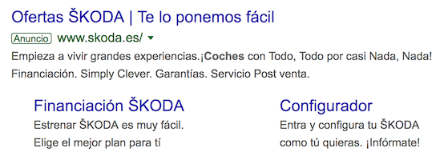

# Pagar por aparecer

La estrategia más básica de marketing en buscadores es pagar por aparecer en los resultados de una búsqueda. En tal caso, los resultados _de pago_ aparecen destacados de alguna forma en la pantalla. Por ejemplo, si hacemos una búsqueda "coche nuevo" en Google, los resultados de pago aparecen destacados al principio del [SERP](https://es.wikipedia.org/wiki/P%C3%A1gina_de_resultados_del_buscador)

La idea es que cuanto más publicidad se paga, más tráfico se consigue y, de paso, también mejora el posicionamiento SEO.

## Enlaces patrocinados

Normalmente, los enlaces patrocinados que aparecen en los resultados debido a SEM pagan por click. Es decir, cuantos más usuarios hagan click en un enlace patrocinado, más debe pagar el cliente al motor de búsqueda con quien ha contratado la campaña.

Es importante elegir las palabras clave compradas y el coste por clic. Existen herramientas para planificar las palabras clave:

!!! example "Lectura: [Google Ads](https://ads.google.com/)"
    Consultar [Google Ads](https://ads.google.com/) (anteriormente _AdWords_) y leer la descripción de su [Funcionamiento](https://ads.google.com/intl/es_es/home/how-it-works/) y [Coste](https://ads.google.com/intl/es_es/home/pricing/)

!!! info "Lectura: Planificador de palabras clave de [Google Ads](https://ads.google.com/)"
    Leer cómo funciona el [planificador de palabras clave](https://ads.google.com/intl/es_ES/home/tools/keyword-planner/) de Google Ads.

También existen herramientas para averiguar cuáles son las palabras más buscadas:

!!! example "Lectura: [Google Trends](https://www.google.es/trends/)"
    Explorar [Google Trends](https://www.google.es/trends/) y consultar las últimas tendencias de búsqueda globales, anuales. Escribir un par de ejemplos de términos de búsqueda para ver el interés a lo largo del tiempo, por región, los temas relacionados y las consultas relacionadas

Es necesario marcarse un presupuesto máximo diario, calcular el coste medio por clic, horarios de mayor impacto.

## Campañas de popularidad

Las campañas de popularidad sirven para incrementar las páginas externas que nos enlazan. Algunas de las técnicas empleadas son:

- Alta en guías y directorios:
    - Servicios Locales: [Google My Business](https://www.google.com/intl/es_es/business/) (antes _Google Places_), www.paginasamarillas.es, etc.
    - Búsquedas de servicios profesionales: www.qdq.com
    - Directorios _verticales_ o especializados por sectores: www.booking.com, www.eltenedor.es, etc.

- Contratar posicionamiento: Una forma de incrementar las páginas que nos enlazan es contratar una técnica SEO basada en _Link building_

!!! tip "[Link Building](https://es.wikipedia.org/wiki/Posicionamiento_en_buscadores#Linkbuilding)"
    Técnica de posicionamiento off-page basada en la captación de enlaces desde otros portales que apunten al proyecto que quieres posicionar

- Campañas en redes sociales

- Creación de concursos o patrocinios para provocar visitas

!!! info "Lectura: [Campañas de Google Ads](https://ads.google.com/intl/es_es/home/resources/advanced/#campaign-types)"
    Explorar los [Tipos de campañas](https://ads.google.com/intl/es_es/home/resources/advanced/#campaign-types) de Google Ads

---

# Contratar publicidad contextual

Otra técnica de marketing es contratar [publicidad contextual](https://en.wikipedia.org/wiki/Contextual_advertising) en sitios web. Esto significa que los anuncios son seleccionados y entregados automáticamente en función de lo que el usuario suele ver y buscar en su navegador (el _contexto_).

---

# Informes y analítica

A partir de las campañas contratadas, existe multitud de herramientas para realizar informes y analítica del éxito de la campaña. Por ejemplo:

!!! example "Lectura: [Google AdSense](https://es.wikipedia.org/wiki/Google_AdSense)"
    Explorar [Google Adsense](https://www.google.es/adsense/start/) y leer la descripción de [AdSense en wikipedia](https://es.wikipedia.org/wiki/Google_AdSense).

---

# Lecturas para profundizar

- Leer el caso de uso de la técnica [A/B Testing](https://es.wikipedia.org/wiki/Prueba_A/B) en la [campaña presidencial de Obama](https://econsultancy.com/seven-lessons-obama-s-digital-team-learned-from-a-b-testing-emails/) en 2013.

- Leer el caso de uso de la técnica de [Minería de datos](https://es.wikipedia.org/wiki/Miner%C3%ADa_de_datos) contratada a [Cambridge Analytica](https://es.wikipedia.org/wiki/Cambridge_Analytica) en la campaña presidencial de Trump en 2016.

- Leer el Blog de Enrique Dans http://www.todovaacambiar.com